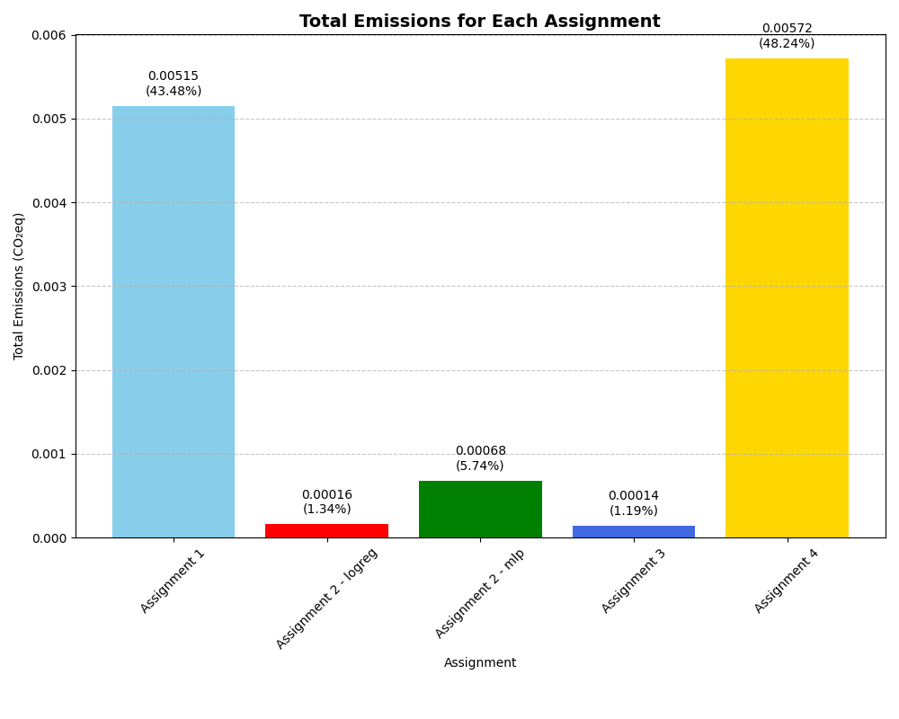
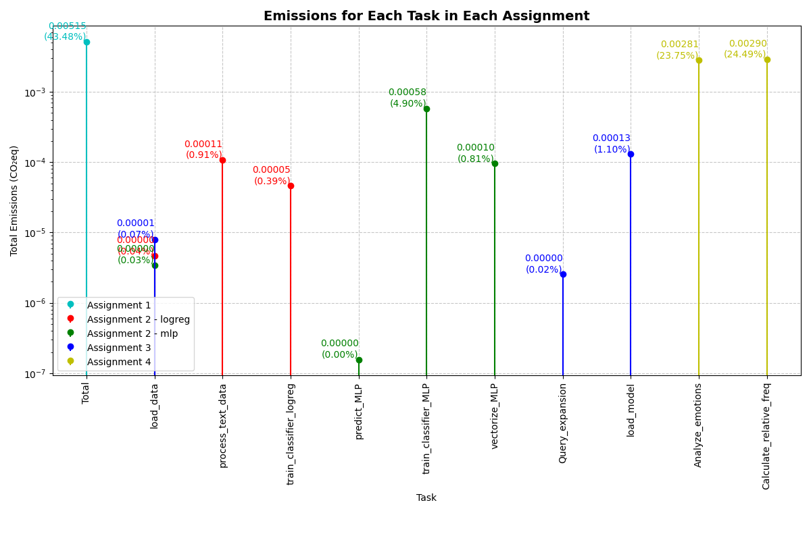

# Assignment 5 - Evaluating Environmental Impact of Your Exam Portfolio

## Description

In this assignment, the environmental impact of the previous 4 assignments in the Language Analytics course is evaluated by measuring the CO₂ emissions generated by the code execution. This was done using the CodeCarbon package, which provides an approximate value for CO₂ emissions expressed as kilograms of CO₂-equivalent (CO₂eq).

## Task Overview

 The CO₂ emissions are assessed for each of the four previous assignments. Specifically, the following questions are adressed:
1. Which assignment generated the most emissions in terms of CO₂eq? Explain why this might be.
2. Which specific tasks generated the most emissions in terms of CO₂eq? Again, explain why this might be.
3. How robust do you think these results are and how/where might they be improved?

## Data Source

The emissions data for each assignment are stored in the "in" folder:
- `emissions_A1.csv`
- `emissions_A2logreg.csv`
- `emissions_A2MLP.csv`
- `emissions_A3.csv`
- `emissions_A4.csv`

## Setup and Running the Analysis

### Requirements

- Python 3
- Libraries: 
  - matplotlib==3.9.0
  - pandas==2.2.2

### Environment Setup

To set up a virtual environment and install the required packages, run the following in the command line:
```bash
bash setup.sh
```

### Running the Script

To execute the analysis script, use the following command:
```bash
bash run.sh
```

## Output

The script generates two main output files:
- `total_emissions.png`: A bar chart showing the total emissions for each assignment.
- `task_emissions.png`: A stem plot showing the emissions for each task in each assignment.

Example outputs:




## Results and Interpretation

### Which assignment generated the most emissions in terms of CO₂eq? Explain why this might be.

- **Assignment 4** - Emotion analysis with pre-trained language models generated the most emissions, accounting for 48.24% of the total emissions. This assignment involved using a pre-trained transformer model from the transformers library for emotion classification. Transformer models, especially those based on the BERT architecture, are computationally intensive due to their large number of parameters and complex attention mechanisms. This results in higher resource consumption during both the loading of the model and the inference phase, where each text input requires significant computational power to process.

In particular, the tasks Analyze_emotions and Calculate_relative_freq required running the emotion classification model on numerous text inputs from the Game of Thrones scripts. This large-scale processing of text data through a transformer model significantly increased the overall computational load, leading to higher CO₂ emissions. 

### Which specific tasks generated the most emissions in terms of CO₂eq? Again, explain why this might be.
The task Analyze_emotions in Assignment 4 generated significant emissions. This could be due to the resource-intensive nature of the task, involving the repeated application of a transformer-based model on a large dataset. Transformer models, such as the one used here, are known for their high computational cost, particularly when processing large volumes of text data.

- **Assignment 1** - Linguistic Analysis with SpaCy, also contributed a notable amount of emissions, but its emissions were concentrated in a single task. This assignment involved processing text data using SpaCy, a popular NLP library, to extract linguistic features such as part-of-speech tags and named entities. The task of loading large text files, processing them with SpaCy, and performing detailed linguistic analysis requires significant computational resources. While SpaCy is optimized for efficiency, the volume of text data and the complexity of the processing tasks (e.g., POS tagging and named entity recognition) contribute to the overall emissions. Despite being measured as a single task, this assignment still made a significant contribution to the total emissions at 43.48%

### How robust do you think these results are and how/where might they be improved?

- **Robustness**: The results are approximate and could vary based on the hardware used and the specific implementations of the tasks.
- **Improvements**: The accuracy of the results can be improved by running the code on a standardized hardware setup and by profiling the code to identify and optimize resource-intensive sections.

## Discussion of Limitations and Possible Steps to Improvement

### Limitations

- The emissions data are approximate and can be influenced by various factors such as hardware specifications, background processes, and the efficiency of the code.
- The results might not be directly comparable across different setups and conditions.

### Possible Steps to Improvement

- Standardize the hardware and environment in which the code is run to minimize variability in the emissions data.
- Optimize the code to reduce unnecessary computational overhead and improve efficiency.
- Use more precise tools and methodologies for measuring environmental impact, if available.

## File Structure

The script assumes the following file structure:
```
assignment5/
├── in/
│   ├── emissions_A1.csv
│   ├── emissions_A2logreg.csv
│   ├── emissions_A2MLP.csv
│   ├── emissions_A3.csv
│   └── emissions_A4.csv
├── out/
│   ├── total_emissions.png
│   └── task_emissions.png
├── setup.sh
├── run.sh
├── script.py
├── requirements.txt
└── README.md
```

## Script

The script used to generate the results is `script.py`. It includes functions to read the CSV files, calculate total emissions, and plot the results. The main steps are:
1. Reading the emissions data from the CSV files.
2. Calculating total emissions for each assignment.
3. Plotting the total emissions for each assignment.
4. Grouping and plotting emissions for each task in each assignment.

The script includes explanatory comments and markdown cells.
